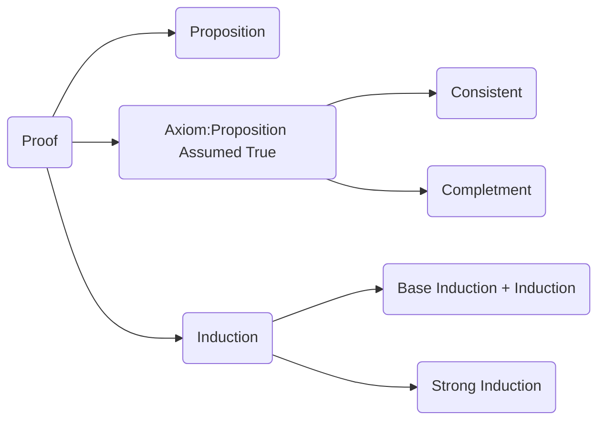
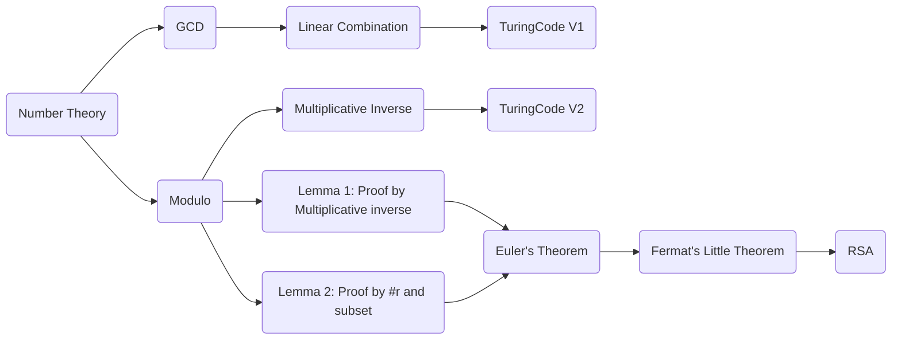

# MIT 6.042J: [Mathematic for Computer Science](https://ocw.mit.edu/courses/electrical-engineering-and-computer-science/6-042j-mathematics-for-computer-science-fall-2010/)

Lecture Note|Assignments
--:|--:
1. Introduction and Proofs  |  [AS]()

# Note

## Lecture 1 & 2: Proofs and Induction

>Source Code of Figure

## Lecture 3 & 4: NumberTheory and Cryptography

>Source Code of Figure

