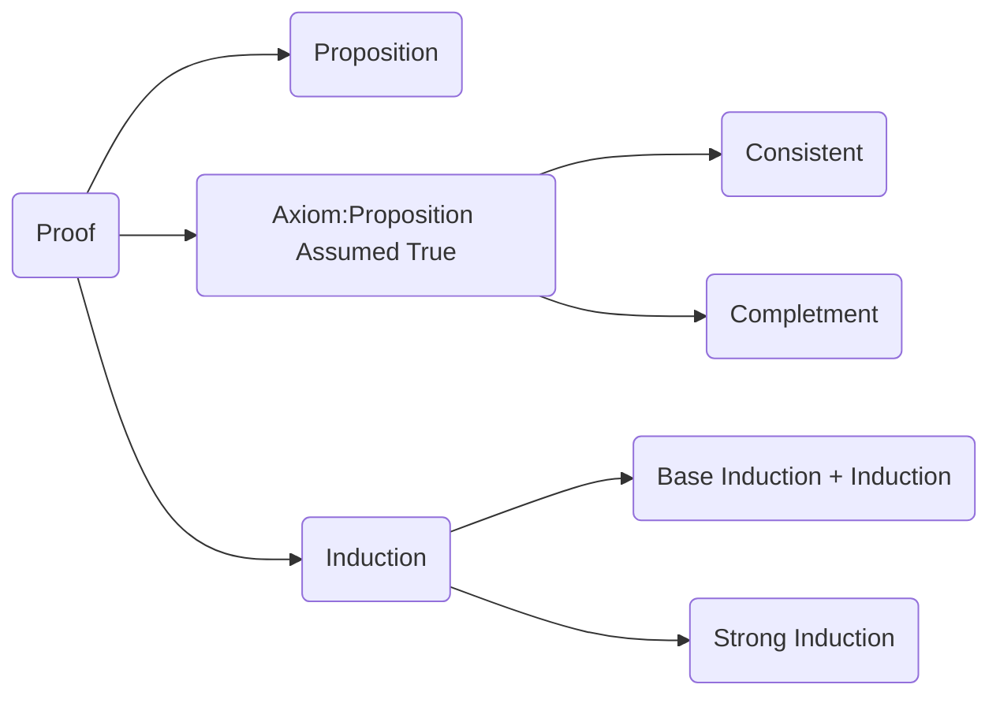
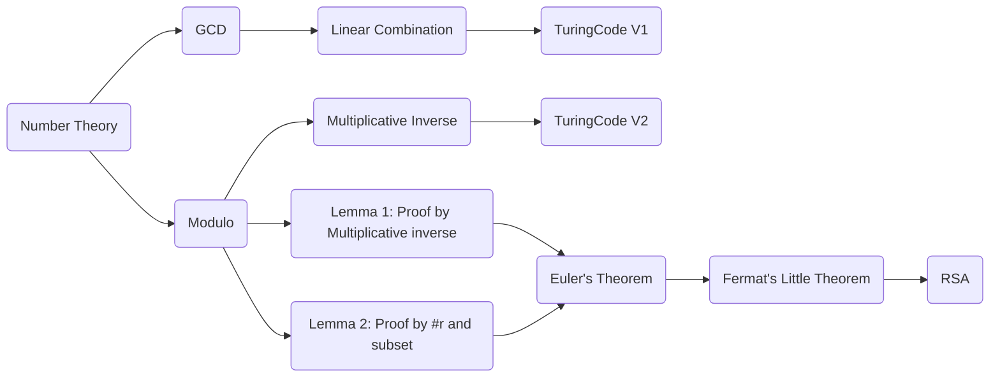
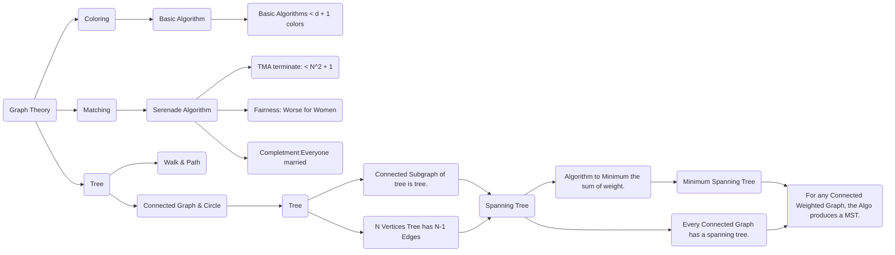
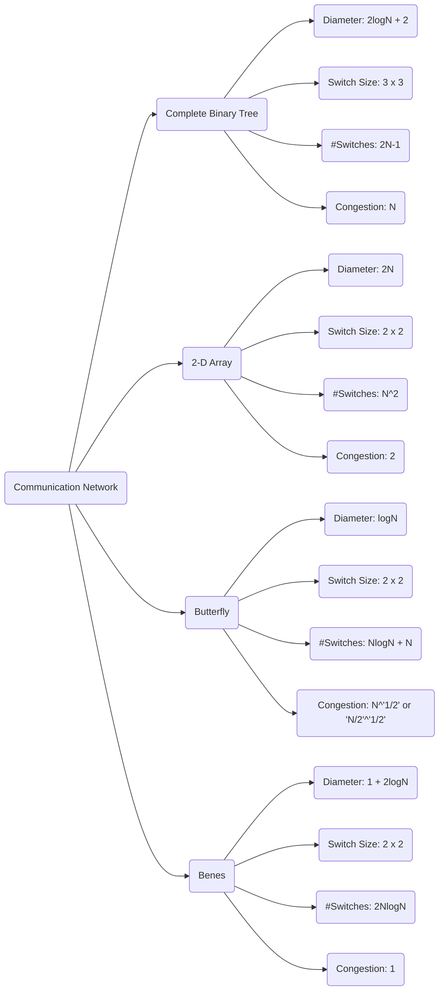

# MIT 6.042J: [Mathematic for Computer Science](https://ocw.mit.edu/courses/electrical-engineering-and-computer-science/6-042j-mathematics-for-computer-science-fall-2010/)

Lecture Note|Assignments
--:|--:
1.Introduction and Proofs | [AS]()
2.NumberTheory | [AS]()

# Note

## Lecture 1 & 2 & 3: Proofs and Induction

>Source Code of Figure

## Lecture 4 & 5: NumberTheory and Cryptography

>Source Code of Figure

##  Lecture 6 & 7 & 8 : Graph Theory: Coloring, Matching and MST

>Source Code for Figure

## Lecture 9: Communication Network

>SourceCode for Figure

