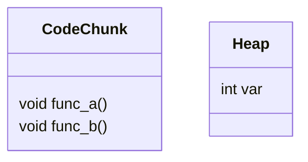

# Appendix: C++

## The Memory layout

It is much indispensable to understand the underlying structure when C++ program implements. However, it is a huge concept. So I wanna emphasize to introduce Memory layout of Virtual Function and Virtual class.

### The Memory layout of virtual function

Firstly, I wanna discuss the type and difference of variable memory used in C++.

|  |Object|Memory Location
|:--:|:--:|:--:|
|**Static Memory**| Static var,obj; func defined outside scope  | **Static Memory**  |
|**Dynamic Memory**  | Ptr var; dynamically allocated var  |  **Heap** |
| **Stack Memory**  | Local var  | **Stack**  |


* Non-Virtual Function:



```i.e```

```cpp
#include<stdio.h>
class C{
public:
    int var;
    void func_a();
    void func_b();
};

```

********

### C++ Memory Control

* Smart Pointer

In C++ 11, to avoid the case out of memory, it provided smart pointer to let us use.

>Using RAII(Resource Acquisition Is Initialization) to make a pointer module as stack object to avoid "out of memory". That makes Smart pointer is actually a object, but pointer.

1. ```std::shared_ptr```

>This Function allowed memory shared by many objects together.

```cpp
#include<memory>

//initialize shared_ptr
std::shared_ptr<int> p3 = std::make_shared<int>(42);

std::shared_ptr<string> p4 = std::make_shared<string>(10,'9');

std::shared_ptr<int> p5 = std::make_shared<int>();

//you could also use direct initialization

std::shared_ptr<int> p6(new int(1024));// true
std::shared_ptr<int> p7 = new int (1024);//false

//Could not implicit a normal pointer
std::shared_ptr<int> clone(int p){
	return new int(p);//false, implicit cast
	return std::shared_ptr<int>;//true
}

//The essence of "make_shared<typename>()" is "new".
make_shared<T>(arg);
shared_ptr<T> p(q); //p is clone of q. q's counter bumpup.
p = q;//exchange
p.use_count();// count the number of reference pointers
p.unique();//if(p.use_count()==1){return true;}else{return false;}
p.reset();//p.use_count() bumpdown
p.reset(p);//?
p.reset(p,d);//?
```

2. ```std::weak_ptr```

>std::shared_ptr also has risk of "out of memory"

**i.e.**

```cpp
#include<stdio.h>
#include<memory>
#include<iostream>
using namespace std;

class Child;
class Parent{
public:
	Parent(){cout<<"Hi, Parent!"<<endl;};
	~Parent(){cout<<"Bye, Parent!"<<endl;};
	shared_ptr<Child> son;
};

class Child{
public:
	Child(){cout<<"Hi, Child!"<<endl;};
	~Child(){cout<<"Bye, Child!"<<endl;};
	shared_ptr<Parent> father;
};

int main(){
	shared_ptr<Parent> parent(new Parent());
	shared_ptr<Children> child(new Child());
	parent->son = child;
	child->father = parent;
	return 0;
}
```

If you implement code above, you would find destructors couldn't work, so out of memory. This is actually caused by ```shared_ptr``` has implemented a (bad) iterate so that ```use_count()``` could not return 0.

>To solve this problem,we use ```weak_ptr```.

```weak_ptr``` collaborates with ```shared_ptr``` but caused bumpup of counter.

>Observer

```cpp
shared_ptr<int> p(new int());
weak_ptr<int> wp(p);
wp.lock()//return shared_ptr
wp.expired();//if(w.use_count() == 0){return true;}else{return false;}
```

You have to use ```lock()``` to operate.

3. ```unique_ptr```

like ```shared_ptr```, but could not share.

Not allowed to be copied.

```cpp
std::unique_ptr<int> ptr1(new int());
std::unique_ptr<int> ptr2 = ptr1;//false
std::unique_ptr<int> ptr3 = std::move(ptr1);//true
```
**C++11: No ```make_unique<>()``` function**

```cpp
unique_ptr<string> str1(new std::string("unique"));
```

**C++14: ```make_unique<>()``` function**

```cpp
unique_ptr<string> str1 = make_unique<string>("unique");

unique_ptr<T> u1;//NULL unique_ptr pointed to T.
unique_ptr<T,D> u2//u2 would use type D to release its pointer

u = nullptr;
u.release();//release pointers, and return NULL
u.reset(p);//reset to point to p
```


## Polymorphism
**Reusable Interface**

**One Interface, More Methods.**

Compile-time Polymorphism: XXX(const XXX &obj):Static polymorphism :Early binding;

Run-time Polymorphism:Virtual:Late binding;

override: Subclass re-defined class.

***************

In C++,
>Interface: Function declaration;

>Implementation: define of function used scop resolution operator.

Hiden:

1. same var, No virtual declaration
2. different var, have/no virtual delaration


Override: same var, virtual declaration;


## OOP
