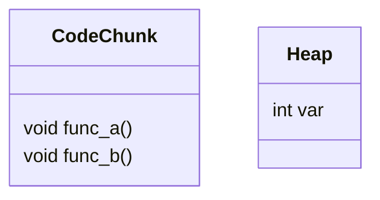

# Appendix: C++

## The Memory layout

It is much indispensable to understand the underlying structure when C++ program implements. However, it is a huge concept. So I wanna emphasize to introduce Memory layout of Virtual Function and Virtual class.

### The Memory layout of virtual function

Firstly, I wanna discuss the type and difference of variable memory used in C++.

|  |Object|Memory Location
|:--:|:--:|:--:|
|**Static Memory**| Static var,obj; func defined outside scope  | **Static Memory**  |
|**Dynamic Memory**  | Ptr var; dynamically allocated var  |  **Heap** |
| **Stack Memory**  | Local var  | **Stack**  |


* Non-Virtual Function:



```i.e```

```cpp
#include<stdio.h>
class C{
public:
    int var;
    void func_a();
    void func_b();
};

```


********


## Polymorphism

## OOP
